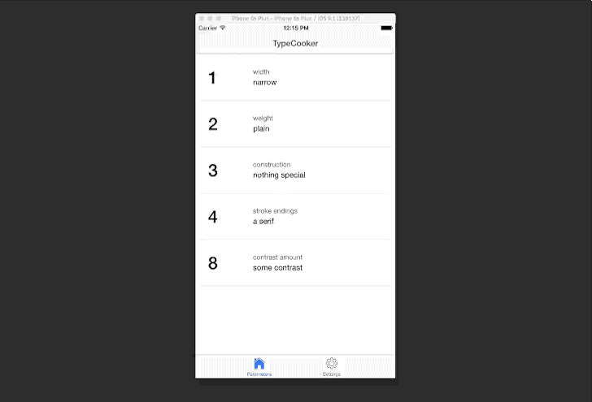

# TypeCooker ToGo

A small TypeCooker app for mobile devices.

## Getting started

To run the app locally, you’ll need a recent version of [Node.js](http://nodejs.org) installed, and to clone the project:

```sh
git clone https://github.com/kennethormandy/typecooker-togo
cd typecooker-togo
```

Now, you can install dependencies:

```sh
npm install -g cordova ionic
npm install
npm start
```

## License

[The MIT License (MIT)](LICENSE.md)

Copyright © 2015 [Kenneth Ormandy](http://kennethormandy.com)
